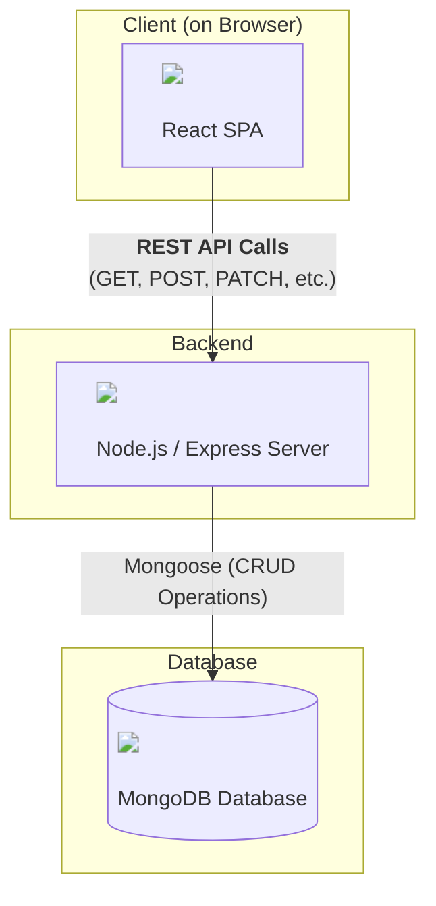
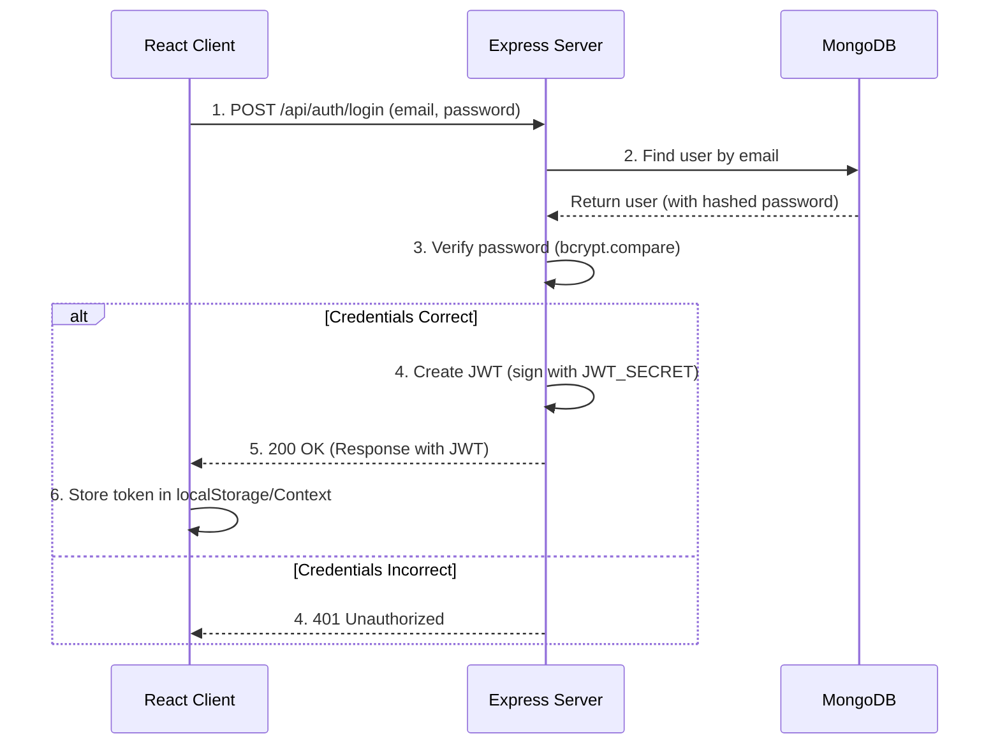
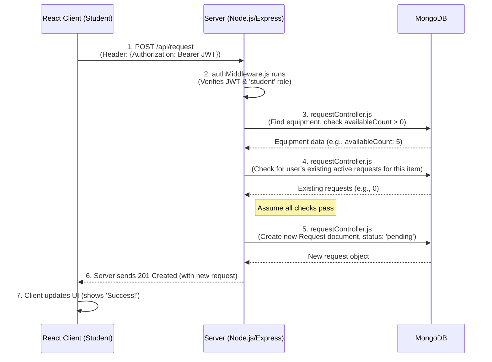

```mermaid
graph TD;
    %% Style Definitions
    classDef provider fill:#d6e4ff,stroke:#333,stroke-width:2px;
    classDef page fill:#e1f7d5,stroke:#333,stroke-width:2px;
    classDef protected fill:#ffdec9,stroke:#333,stroke-width:2px;
    classDef router fill:#f9f3c2,stroke:#333,stroke-width:2px;

    %% Component Hierarchy
    A[App] --> B(AuthProvider);
    B --> C(Router);
    C --> D{Routes};

    class A,B provider;
    class C,D router;

    subgraph Public Routes
        D --> Login[Login<br>/login];
        D --> Register[Register<br>/register];
        D --> Unauthorized[Unauthorized<br>/unauthorized];
        D --> ErrorPage[ErrorPage<br>/*];
        D --> Navigate[Navigate<br>to /login];
    end

    subgraph Protected Routes
        D --> P1(ProtectedRoute);
        P1 --> EL[EquipmentList<br>/equipment];

        D --> P2(ProtectedRoute<br>roles: ['admin']);
        P2 --> AD[AdminDashboard<br>/admin/dashboard];
        
        D --> P3(ProtectedRoute<br>roles: ['admin', 'staff']);
        P3 --> RM[RequestManagement<br>/requests];

        D --> P4(ProtectedRoute);
        P4 --> MR[MyRequests<br>/my-requests];
    end

    %% Apply Page and ProtectedRoute styles
    class Login,Register,Unauthorized,ErrorPage,Navigate,EL,AD,RM,MR page;
    class P1,P2,P3,P4 protected;
```




