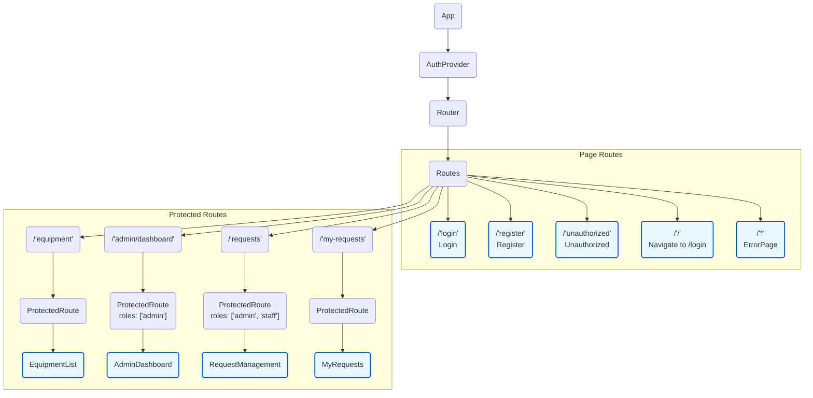
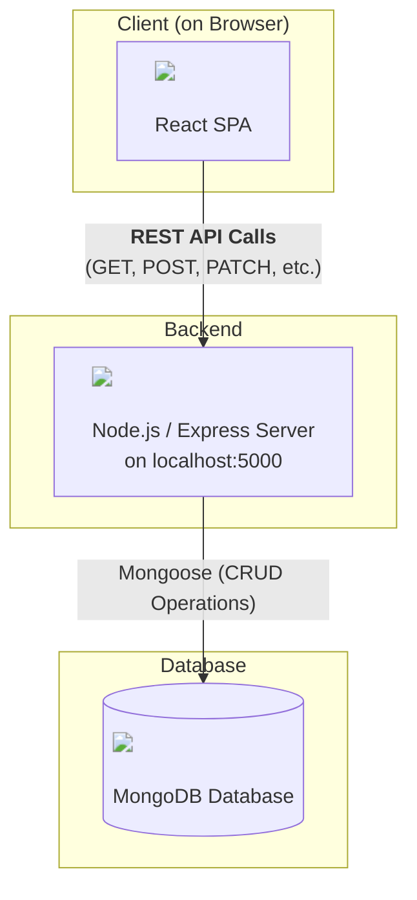
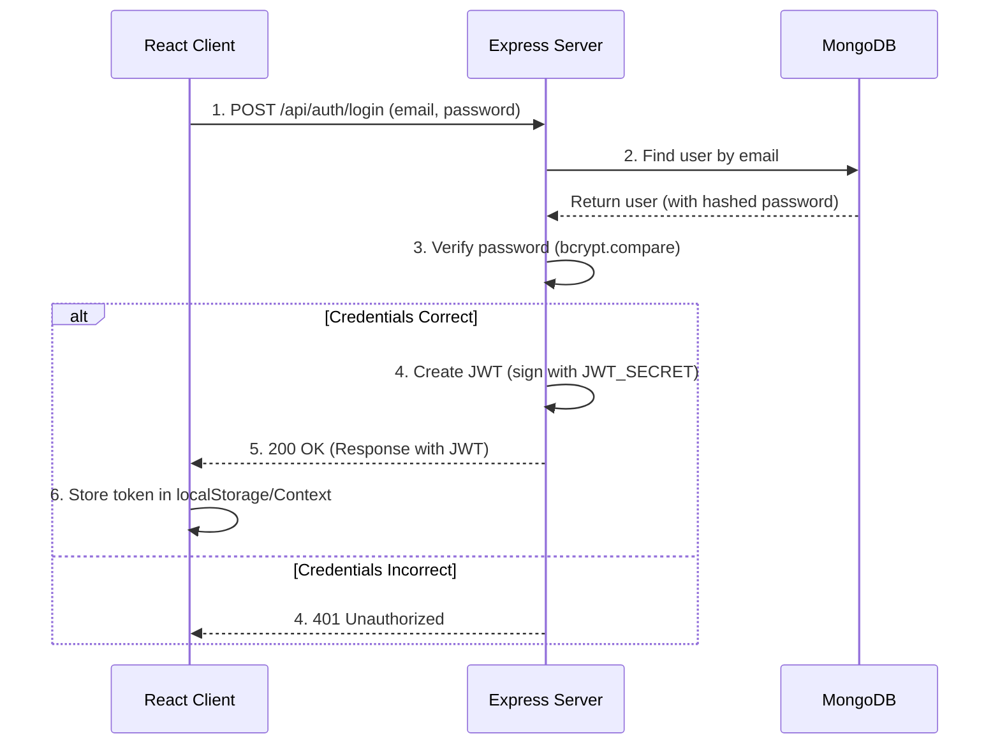
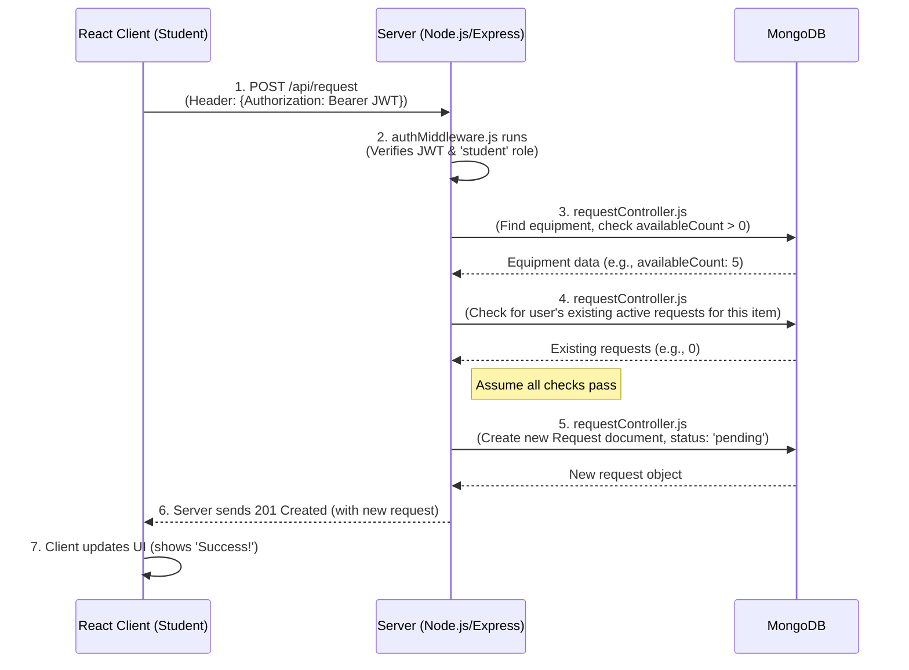

```mermaid
graph TD
    App(App) --> Auth(AuthProvider)
    Auth --> Router(Router)
    Router --> Routes(Routes)

    subgraph "Page Routes"
        Routes --> R_Login("/'login' <br> Login")
        Routes --> R_Reg("/'register' <br> Register")
        Routes --> R_Unauth("/'unauthorized' <br> Unauthorized")
        Routes --> R_Root("/'/' <br> Navigate to /login")
        Routes --> R_Wild("/'*' <br> ErrorPage")
    end

    subgraph "Protected Routes"
        Routes --> P1("/'equipment'")
        P1 --> PR1(ProtectedRoute)
        PR1 --> Equip(EquipmentList)

        Routes --> P2("/'admin/dashboard'")
        P2 --> PR2("ProtectedRoute <br> roles: ['admin']")
        PR2 --> Admin(AdminDashboard)

        Routes --> P3("/'requests'")
        P3 --> PR3("ProtectedRoute <br> roles: ['admin', 'staff']")
        PR3 --> Req(RequestManagement)

        Routes --> P4("/'my-requests'")
        P4 --> PR4(ProtectedRoute)
        PR4 --> MyReq(MyRequests)
    end

    classDef page fill:#e6f7ff,stroke:#0056b3,stroke-width:2px;
    class R_Login,R_Reg,R_Unauth,R_Root,R_Wild,Equip,Admin,Req,MyReq page;
```

```mermaid
graph TD
    subgraph "Client (on Browser)"
        Client[<img src="https://upload.wikimedia.org/wikipedia/commons/a/a7/React-icon.svg" width="30" /> <br> React SPA]
    end

    %% --- Change is here ---
    subgraph "Backend"
        Server[<img src="https://static-00.iconduck.com/assets.00/nodejs-icon-2048x2048-rpc0nxxb.png" width="30" /> <br> Node.js / Express Server <br> on localhost:5000]
    end
    %% --- End of Change ---
    
    subgraph "Database"
        DB[(<img src="https://static-00.iconduck.com/assets.00/mongodb-icon-2048x2048-n0crh6w2.png" width="30" /> <br> MongoDB Database)]
    end

    Client -- "<b>REST API Calls</b><br>(GET, POST, PATCH, etc.)" --> Server
    Server -- "Mongoose (CRUD Operations)" --> DB
```

```mermaid
sequenceDiagram
    participant C as React Client
    participant S as Express Server
    participant DB as MongoDB

    C ->> S: 1. POST /api/auth/login (email, password)
    S ->> DB: 2. Find user by email
    DB -->> S: Return user (with hashed password)
    S ->> S: 3. Verify password (bcrypt.compare)
    
    alt Credentials Correct
        S ->> S: 4. Create JWT (sign with JWT_SECRET)
        S -->> C: 5. 200 OK (Response with JWT)
        C ->> C: 6. Store token in localStorage/Context
    else Credentials Incorrect
        S -->> C: 4. 401 Unauthorized
    end
```

```mermaid
sequenceDiagram
    participant C as React Client (Student)
    participant S as Server (Node.js/Express)
    participant DB as MongoDB

    C ->> S: 1. POST /api/request <br> (Header: {Authorization: Bearer JWT})
    
    S ->> S: 2. authMiddleware.js runs <br> (Verifies JWT & 'student' role)
    
    S ->> DB: 3. requestController.js <br> (Find equipment, check availableCount > 0)
    DB -->> S: Equipment data (e.g., availableCount: 5)
    
    S ->> DB: 4. requestController.js <br> (Check for user's existing active requests for this item)
    DB -->> S: Existing requests (e.g., 0)
    
    note right of S: Assume all checks pass
    
    S ->> DB: 5. requestController.js <br> (Create new Request document, status: 'pending')
    DB -->> S: New request object
    
    S -->> C: 6. Server sends 201 Created (with new request)
    C ->> C: 7. Client updates UI (shows 'Success!')
```
