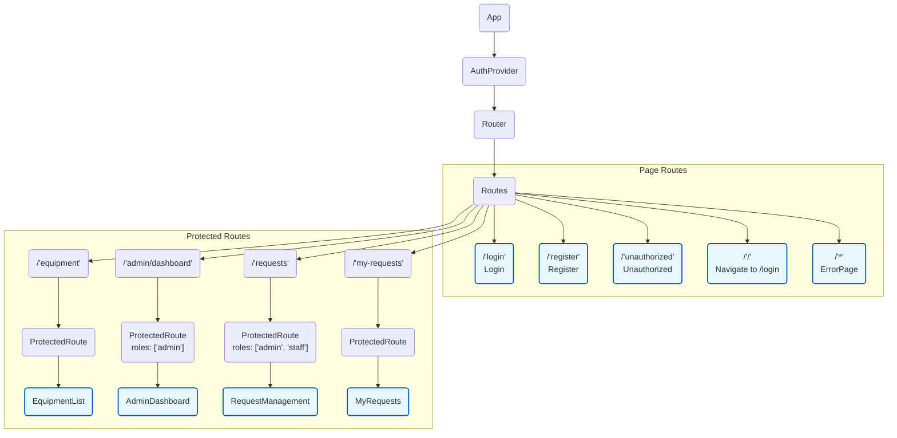
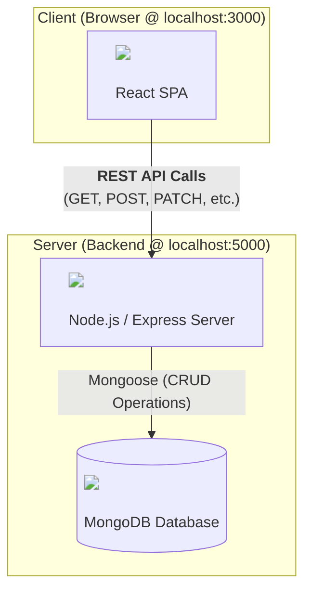

```mermaid
graph TD
    App(App) --> Auth(AuthProvider)
    Auth --> Router(Router)
    Router --> Routes(Routes)

    subgraph "Page Routes"
        Routes --> R_Login("/'login' <br> Login")
        Routes --> R_Reg("/'register' <br> Register")
        Routes --> R_Unauth("/'unauthorized' <br> Unauthorized")
        Routes --> R_Root("/'/' <br> Navigate to /login")
        Routes --> R_Wild("/'*' <br> ErrorPage")
    end

    subgraph "Protected Routes"
        Routes --> P1("/'equipment'")
        P1 --> PR1(ProtectedRoute)
        PR1 --> Equip(EquipmentList)

        Routes --> P2("/'admin/dashboard'")
        P2 --> PR2("ProtectedRoute <br> roles: ['admin']")
        PR2 --> Admin(AdminDashboard)

        Routes --> P3("/'requests'")
        P3 --> PR3("ProtectedRoute <br> roles: ['admin', 'staff']")
        PR3 --> Req(RequestManagement)

        Routes --> P4("/'my-requests'")
        P4 --> PR4(ProtectedRoute)
        PR4 --> MyReq(MyRequests)
    end

    classDef page fill:#e6f7ff,stroke:#0056b3,stroke-width:2px;
    class R_Login,R_Reg,R_Unauth,R_Root,R_Wild,Equip,Admin,Req,MyReq page;
```

```mermaid
graph TD
    subgraph "Client (Browser @ localhost:3000)"
        Client[<img src="https://upload.wikimedia.org/wikipedia/commons/a/a7/React-icon.svg" width="30" /> <br> React SPA]
    end

    subgraph "Server (Backend @ localhost:5000)"
        Server[<img src="https://static-00.iconduck.com/assets.00/nodejs-icon-2048x2048-rpc0nxxb.png" width="30" /> <br> Node.js / Express Server]
        DB[(<img src="https://static-00.iconduck.com/assets.00/mongodb-icon-2048x2048-n0crh6w2.png" width="30" /> <br> MongoDB Database)]
        Server -- "Mongoose (CRUD Operations)" --> DB
    end

    Client -- "<b>REST API Calls</b><br>(GET, POST, PATCH, etc.)" --> Server

```
